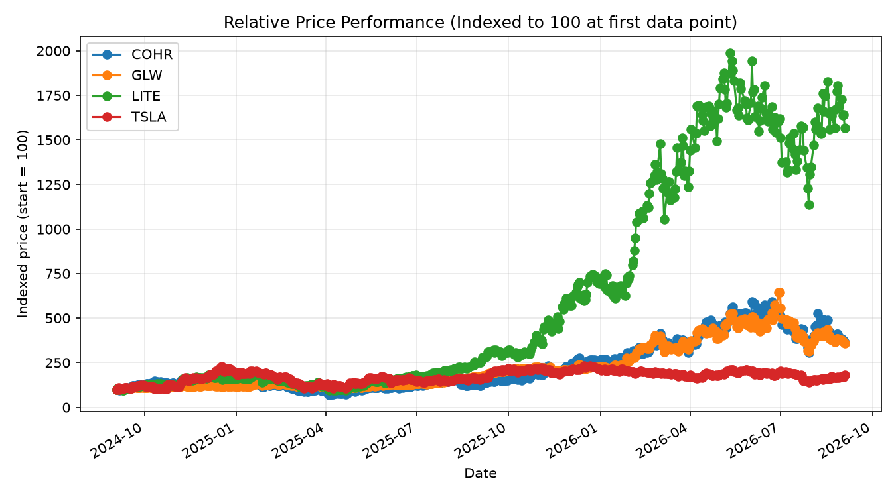

# Python Stock Analysis

A pandas + matplotlib toolkit for analysing price trends, returns, and volatility across a small equity watchlist, with a normalized comparison chart to benchmark relative performance across stocks with different data start dates.

## Problem
Comparing performance across stocks isn't just "which price went up more" — different stocks have different starting prices, so raw price charts are misleading. You need returns indexed to a common base, plus a read on how volatile the ride was to get there.

## Approach
- Loads price data from CSV into a pandas DataFrame.
- Computes period-over-period % return and cumulative return per ticker using `groupby` + `pct_change`.
- Builds a summary table per ticker: total return, average absolute period return, and an approximate annualised volatility (return std dev scaled by the average sampling frequency — flagged as an approximation given irregular sample spacing, see Limitations).
- Plots a normalized comparison chart (each ticker indexed to 100 at its own first data point) so tickers can be benchmarked on relative performance regardless of start date, using matplotlib.

## Data
Seeded with real, dated closing prices for Coherent (COHR) and Tesla (TSLA), sourced from simplywall.st, macrotrends, seekingalpha, tradingeconomics, and stockanalysis.com (2025-12 to 2026-08). This is a sparse, manually-sourced dataset, not full daily OHLCV — `fetch_data.py` is the production script that pulls complete daily price history via the `yfinance` API when run locally with internet access.

## Result (from the seeded dataset)

| Ticker | Window | Total Return | Approx. Annualised Volatility |
|---|---|---|---|
| COHR | Sep 2024 – Sep 2026 | +261.8% | ~77.6% |
| GLW | Sep 2024 – Sep 2026 | +260.1% | ~54.6% |
| LITE | Sep 2024 – Sep 2026 | +1467.0% | ~82.4% |
| TSLA | Sep 2024 – Sep 2026 | +79.8% | ~60.2% |

The seeded dataset shows significant dispersion in returns across the selected universe. LITE generated the strongest performance, returning approximately 1467% over the observation period, albeit alongside elevated volatility. COHR and GLW both delivered returns above 260%, substantially outperforming TSLA's 79.8% return.

The comparison highlights how securities exposed to similar technology and AI-infrastructure themes can exhibit very different risk-return profiles. While higher-performing names produced outsized gains, they also experienced higher volatility, illustrating the trade-off between return potential and investment risk that underpins portfolio construction and equity analysis.

# Example Output


## Tech stack
Python, pandas, matplotlib, `yfinance` (for live data)

## How to run it
```bash
pip install -r requirements.txt
python analysis.py          # uses full daily data if present, else the seed sample
python fetch_data.py        # (requires internet) pulls full daily history to data/prices_full.csv
```
Once `fetch_data.py` has been run, `analysis.py` automatically switches to the full dataset on the next run \u2014 no code changes needed.

## What I'd improve next
- The annualised volatility figure is an approximation because the seed data has irregular gaps between sample dates — with full daily data from `fetch_data.py`, this becomes a standard, much more reliable calculation.
- Add a rolling moving average overlay (20/50-day) once daily data is available — not meaningful yet with only 4-6 sparse points per ticker.
- Add a correlation matrix across the watchlist once date ranges overlap with full daily data.
